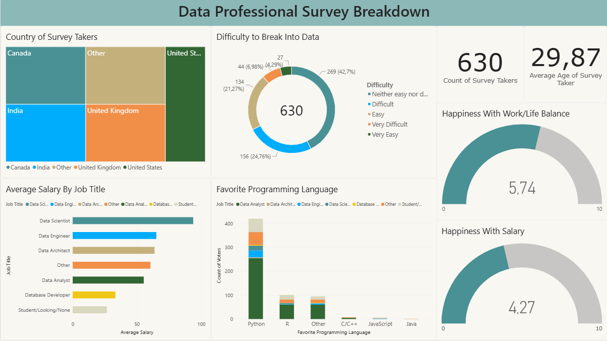

# Power BI – Data Professionals Survey Dashboard

## Project Overview

An interactive **Power BI dashboard** built to analyze survey data from **630 respondents** working in or interested in the data industry.

The dashboard explores key questions around **salary, job roles, programming language preferences, job satisfaction, work-life balance, and barriers to entering the data field**.

---

## Business Questions

This dashboard was designed to answer questions such as:

* Which data-related roles have the highest estimated salaries?
* Which programming languages are most popular among respondents?
* How do salary levels vary across countries?
* How satisfied are respondents with their salary and work-life balance?
* How difficult do respondents perceive entering the data industry to be?

---

## Key Insights

* **Python** is the most popular programming language among respondents, followed by **R** and **C/C++**.
* **Data Scientists** have the highest estimated average salary at approximately **$93k**, followed by Data Engineers (\~$65k) and Data Architects (\~$63k).
* **Data Analysts** have an estimated average salary of approximately **$55k**.
* Respondents report higher satisfaction with **work-life balance (5.74/10)** than with **salary (4.27/10)**.
* **42.7%** of respondents consider entering the data industry neither easy nor difficult, while **24.8%** consider it easy.
* Estimated salary levels vary significantly across countries, highlighting substantial differences between regional data labor markets.

> **Note:** Salary figures are estimates calculated from the midpoint of reported salary ranges rather than actual individual salaries.

---

## Technical Skills Demonstrated

### Power BI

* Interactive dashboard development
* Data modeling and visualization
* KPI cards, bar charts, treemaps, stacked columns, donut charts, and gauges
* Interactive filtering and cross-visual analysis

### Power Query

* Data cleaning and transformation
* Removing irrelevant columns
* Standardizing inconsistent text values
* Splitting and transforming text-based fields
* Converting salary ranges into numerical values

### DAX

* Calculated measures
* Aggregations and averages
* Respondent counts
* Satisfaction metrics
* Salary analysis

---

## Data Transformation

The original dataset contained salary information as text ranges, for example:

`$106k-$125k`

These values were transformed into numerical estimates by extracting the lower and upper bounds and calculating their midpoint.

This created an **Estimated Average Salary** field that could be used for salary comparisons across job titles and countries.

---

## Dataset

* **Author:** Alex Freberg (Alex The Analyst)
* **Sample:** 630 respondents
* **Geography:** Multiple countries, including the US, Canada, UK, and India
* **Key fields:** Job title, salary range, age, country, programming language preference, work-life balance, salary satisfaction, and perceived difficulty of entering the data industry.
